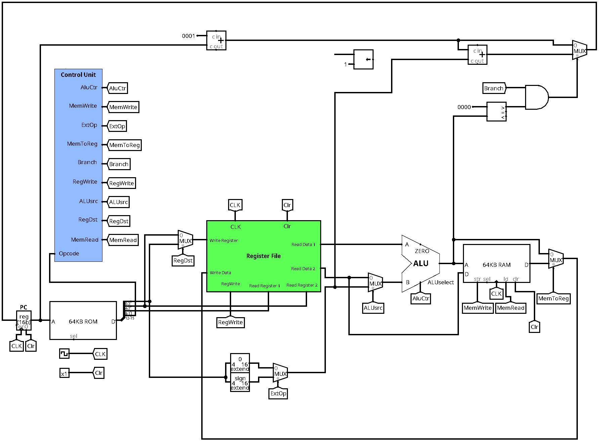

# 16bit-CPU

A simple 16-bit cpu designed in Logisim and coded in Verilog

This is the project of Computer Architecture and Design Class.

## Instructions format

Every Instruction is 16-bit so they are basically one format but the bits could have different meanings.

### I-format

Opcode(4-bit) | Rs(4-bit) | Rt(4-bit) | Rd(4-bit)

### R-format

Opcode(4-bit) | Rs(4-bit) | Rt(4-bit) | Imm/Address/Offset(4-bit)

## Instructions and Opcodes

| Instruction | Opcode | Format |
|---------------|-----------|-----------|
|add|0000|R|
|sub|0001|R|
|mul|0010|R|
|div|0011|R|
|ori|0100|I|
|nor|0101|R|
|nand|0110|R|
|sw|0111|I|
|lw|1000|I|
|blt|1001|I|

P.S. Unfortunately the verilog code probably does not work as intended, you would be more than welcome to find its problem(s) and fix it!
